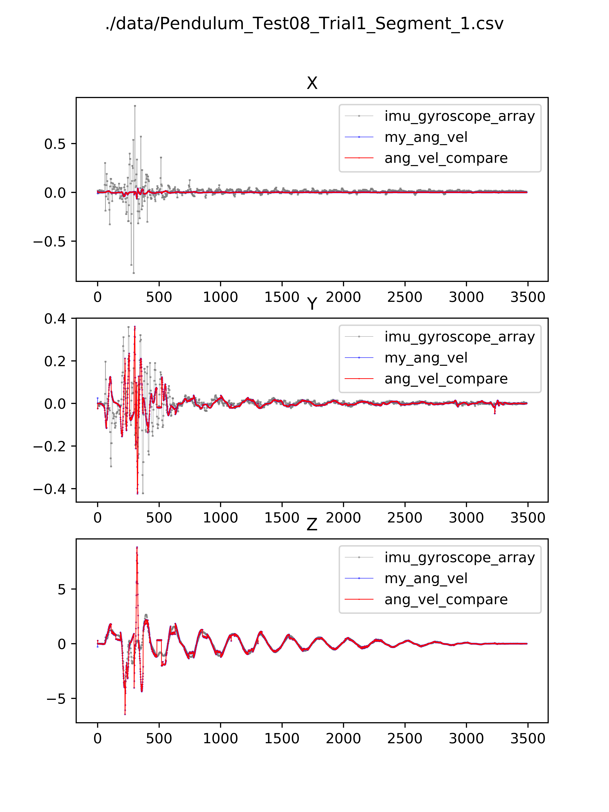
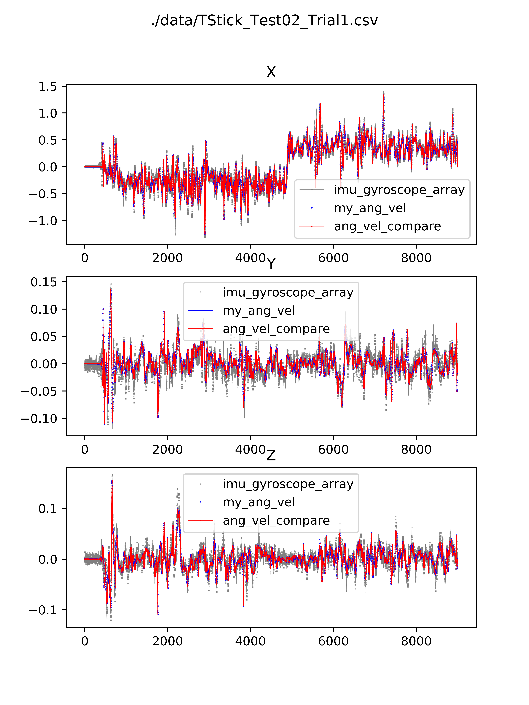

# Test Calculating Angular Velocity using Quaternion Differentiation

## Result Comparison

Red line (ang_vel_compare) is calculated using the method from <a href="#ref2">[2]</a> and <a href="#ref3">[3]</a>.

Blue line (my_ang_vel) is calculated myself, almost completely overlapped with red.

Grey line (imu_gryoscope_array) is the "ground truth" from <a href="#ref4">[4]</a>.

  
  

More results in /data proved the equivalence.

## References

[1] https://quaternions.online/

[2] https://github.com/Mayitzin/ahrs/blob/c82197605ad719dedfa057ee8808b1df397e02ad/ahrs/common/quaternion.py#L3011

[3] https://mariogc.com/post/angular-velocity-quaternions/

[4] https://github.com/agnieszkaszczesna/RepoIMU
